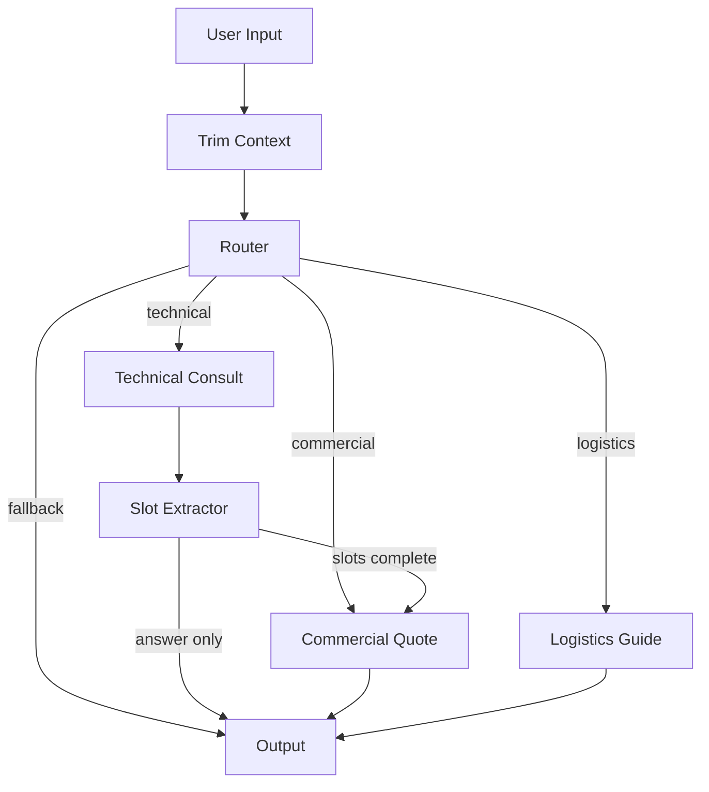

# Exosome CRO Agent — Intelligent Customer Service System

LangGraph-based intelligent customer service agent for an exosome (exosome/extracellular vesicle) research CRO company. Privately deployed on a single RTX 4090 24G GPU with INT4 quantized 14B model.

## Features

- **LangGraph State Machine**: Deterministic multi-turn dialogue flow with conditional routing (technical / commercial / logistics)
- **QLoRA Domain Fine-tuning**: Three-stage fine-tuning (terminology → slot extraction → general dialogue mixing) with DPO preference alignment
- **Local RAG Knowledge Base**: FAISS + bge-small-zh-v1.5 embedding, CPU-only vector retrieval with strict anti-hallucination prompts
- **AWQ INT4 Quantization**: vLLM deployment optimized for single consumer GPU (RTX 4090 24G)
- **Hard Safety Boundaries**: Template-based quoting (no LLM for prices), Pydantic output validation, confidence-based fallback routing

## Architecture



See `docs/architecture.md` for full topology, node descriptions, and safety boundary documentation.

## Data Anonymization Notice

**All prices, service codes, SOPs, and FAQ entries in this repository are FICTIONAL example values created for system demonstration purposes only.** See `docs/data_notice.md` for the complete list of affected files.

## Hardware Budget

| Component | Specification | Est. Cost (CNY) |
|-----------|--------------|------------------|
| GPU | NVIDIA RTX 4090 24G (used) | ~8,000 |
| CPU | Intel i5-13600KF | ~1,500 |
| Motherboard | Z790 / B760 | ~1,200 |
| RAM | DDR5 32 GB | ~600 |
| Storage | 1 TB NVMe SSD | ~400 |
| PSU + Case | 850W 80+ Gold | ~1,000 |
| **Total** | | **~12,700** |

**Budget target**: < ¥15,000 met. See `docs/hardware_budget.md` for alternative configurations (RTX 3090, 7B model).

### VRAM Breakdown (RTX 4090 24G)

| Component | VRAM |
|-----------|------|
| Model weights (INT4) | 7.5 GB |
| KV Cache (8K tokens) | 6.3 GB |
| Runtime overhead | 4.0 GB |
| **Total** | **17.8 GB** |
| Headroom | 6.2 GB |

## Quick Start

```bash
# Install dependencies
pip install -r requirements.txt

# Generate training data
python src/training/dataset_stage1_terminology.py
python src/training/dataset_stage2_slot.py
python src/training/dataset_stage3_general.py
python src/training/dpo_dataset_builder.py

# Build RAG index (with mock data)
python -c "
from src.rag.embedder import ExosomeEmbedder
from src.rag.vector_store import ExosomeVectorStore
from src.rag.chunker import PriceChunker, SOPChunker
import json
with open('data/mock/knowledge_base.json') as f:
    data = json.load(f)
chunks = PriceChunker().chunk_from_json(data['services'])
for sop in data['sops']:
    chunks.extend(SOPChunker().chunk(sop['content'], source=sop['id']))
embedder = ExosomeEmbedder()
store = ExosomeVectorStore()
store.build_index(embedder.embed_batch([c['text'] for c in chunks]), chunks)
store.save()
print(f'Index built: {len(store)} chunks')
"

# Run tests
pytest tests/ -v
```

## Docker Deployment

```bash
# Build and start
docker compose up -d

# Check status
docker compose logs -f

# Stop
docker compose down
```

The vLLM API server will be available at `http://localhost:8000`.

## Model Training Pipeline

```
Qwen2.5-14B-Instruct (FP16, 28 GB)
  -> QLoRA SFT (Unsloth, 4-bit, Rank=64)
    -> Stage 1: Terminology alignment (500 samples, 3 epochs)
    -> Stage 2: Slot extraction (800 samples, 2 epochs)
    -> Stage 3: General dialogue mix (300 samples, 1 epoch)
  -> DPO Preference Alignment (400 pairs, 1 epoch)
  -> Merge LoRA -> FP16 (28 GB)
  -> AWQ INT4 Quantization (7.5 GB)
  -> vLLM Deployment (fits RTX 4090 24G)
```

Training time: ~6-8 hours on a single RTX 4090.

## Project Structure

```
src/
├── agent/          # LangGraph state machine
│   ├── nodes/      # Graph nodes (router, technical, commercial, logistics)
│   ├── routing/    # Conditional edge functions
│   └── context/    # Token trimming and summarization
├── training/       # QLoRA fine-tuning + DPO scripts
├── rag/            # Local RAG pipeline (FAISS + bge)
├── safety/         # Pydantic validation + confidence routing
└── deploy/         # AWQ quantization + vLLM serving
configs/            # YAML configuration files
data/
├── mock/           # Fictional knowledge base (services, SOPs, FAQs)
└── training/       # Generated training datasets
docs/               # Architecture, budget, conversation demos
tests/              # Unit tests
```

## Demo Conversations

See `docs/conversation_demo.md` for example conversations covering technical consultation, commercial quotation, logistics guidance, knowledge gap handling, and medical advice refusal.

## License

This project is for demonstration purposes. All data is fictional.
