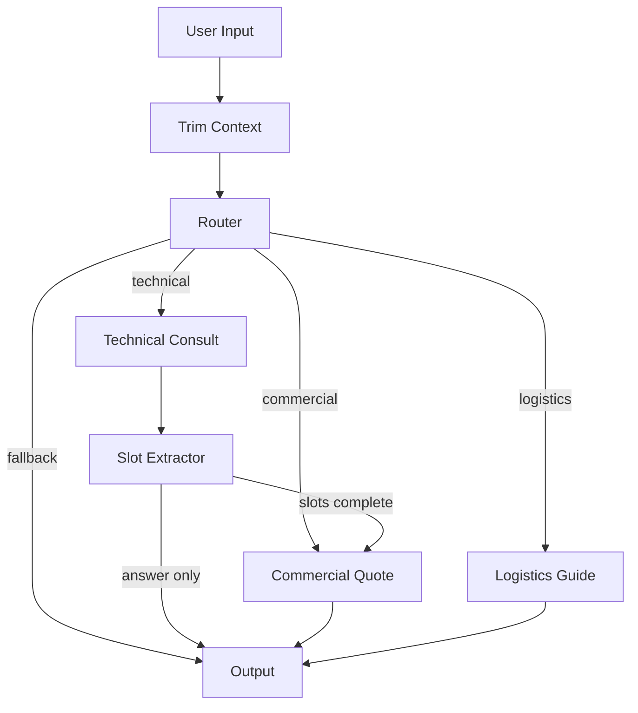

# Exosome CRO Agent — Intelligent Customer Service System

LangGraph-based intelligent customer service agent for an exosome (exosome/extracellular vesicle) research CRO company. Privately deployed on a single RTX 4090 24G GPU with INT4 quantized 14B model.

## Features

- **LangGraph State Machine**: Deterministic multi-turn dialogue flow with conditional routing (technical / commercial / logistics)
- **QLoRA Domain Fine-tuning**: Three-stage fine-tuning (terminology → slot extraction → general dialogue mixing) with DPO preference alignment
- **Local RAG Knowledge Base**: FAISS + bge-small-zh-v1.5 embedding, CPU-only vector retrieval with strict anti-hallucination prompts
- **AWQ INT4 Quantization**: vLLM deployment optimized for single consumer GPU (RTX 4090 24G)
- **Hard Safety Boundaries**: Template-based quoting (no LLM for prices), Pydantic output validation, confidence-based fallback routing

## Architecture



## Data Anonymization Notice

**All prices, service codes, SOPs, and FAQ entries in this repository are FICTIONAL example values created for system demonstration purposes only.** They do not represent any real company's commercial data, experimental protocols, or customer information.

## Hardware Requirements

| Component | Specification |
|-----------|--------------|
| GPU | NVIDIA RTX 4090 24G (or RTX 3090 24G) |
| RAM | 32 GB |
| Storage | 100 GB SSD |
| OS | Ubuntu 22.04 |

**Total hardware cost**: < ¥15,000

## Quick Start

```bash
# Install dependencies
pip install -r requirements.txt

# Run the agent (interactive CLI demo)
python -m src.agent.graph
```

## Project Structure

```
src/
├── agent/          # LangGraph state machine
│   ├── nodes/      # Graph nodes (router, technical, commercial, logistics)
│   ├── routing/    # Conditional edge functions
│   └── context/    # Token trimming and summarization
├── training/       # QLoRA fine-tuning + DPO scripts
├── rag/            # Local RAG pipeline (FAISS + bge)
├── safety/         # Pydantic validation + confidence routing
└── deploy/         # AWQ quantization + vLLM serving
```

## License

This project is for demonstration purposes. All data is fictional.
