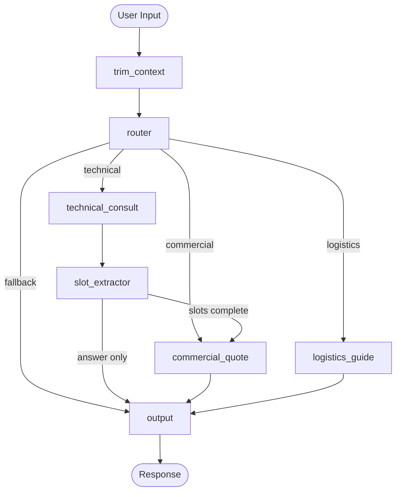

# Exosome CRO Agent — Architecture

## LangGraph Topology



## Node Descriptions

### trim_context
- **Type**: Pre-processing node (always runs first)
- **Function**: Trims message history to 4000 tokens max. Older messages are compressed into `background_summary`. Sets `hardware_boundary_triggered` if >50% of messages were dropped.
- **Rationale**: Prevent OOM on single consumer GPU with 8K context window.

### router
- **Type**: Rule-based classifier (no LLM)
- **Function**: Classifies user intent as `technical`, `commercial`, `logistics`, or `fallback` using keyword + regex matching.
- **Rationale**: Zero-latency deterministic routing. Price/logistics queries MUST bypass the LLM.

### technical_consult
- **Type**: LLM inference node
- **Function**: Calls the fine-tuned model (Qwen2.5-14B QLoRA + DPO) to answer exosome biology questions. Returns mock responses during development.
- **Rationale**: Core domain expertise — this is where the fine-tuned model adds value.

### slot_extractor
- **Type**: Structured extraction node
- **Function**: Extracts `sample_type`, `sample_count`, `downstream_exp`, `qc_requirements` from conversation using regex (dev) or LLM function calling (production).
- **Rationale**: Converts unstructured conversation into structured business parameters for downstream quoting.

### commercial_quote
- **Type**: Template rendering node (no LLM)
- **Function**: Renders a Markdown quotation from hardcoded pricing templates. Detects missing required fields and prompts the user.
- **Rationale**: Prices MUST be deterministic. LLM hallucination of pricing data is a hard failure mode.

### logistics_guide
- **Type**: Template rendering node (no LLM)
- **Function**: Returns shipping SOPs based on sample type. Includes general packaging guidelines + sample-type-specific preparation instructions.
- **Rationale**: Shipping addresses, packaging requirements, and courier instructions must be accurate and consistent.

### output
- **Type**: Terminal node
- **Function**: Returns the final message to the user.

## Data Flow

```
User Message
  → trim_context (token budget enforcement)
    → router (intent classification)
      → technical: LLM → slot_extractor → conditional check
          → slots complete? → commercial_quote → output
          → answer only? → output
      → commercial: template quote → output
      → logistics: template SOP → output
      → fallback: clarification prompt → output
```

## Safety Boundaries

| Boundary | Mechanism | Trigger |
|----------|-----------|---------|
| Context overflow | `trim_context` | Token count > 4000 |
| Low confidence | `confidence_router` | confidence < 0.6 |
| JSON parse failure | `pydantic_validator` | Pydantic ValidationError |
| Unknown knowledge | RAG prompt rule | No retrieved chunks |
| Price hallucination | Template routing | Commercial intent → hard redirect |

## Model Training Pipeline

```
Qwen2.5-14B-Instruct (FP16, 28 GB)
  → QLoRA SFT (Unsloth, 4-bit, Rank=64)
    → Stage 1: Terminology alignment (500 samples, 3 epochs)
    → Stage 2: Slot extraction (800 samples, 2 epochs)
    → Stage 3: General dialogue mix (300 samples, 1 epoch)
  → DPO Preference Alignment (400 pairs, 1 epoch)
  → Merge LoRA → FP16 (28 GB)
  → AWQ INT4 Quantization (7.5 GB)
  → vLLM Deployment (RTX 4090 24G)
```

## Hardware Budget

| Component | VRAM |
|-----------|------|
| Model weights (INT4) | 7.5 GB |
| KV Cache (8K ctx) | 6.3 GB |
| Runtime overhead | 4.0 GB |
| **Total** | **17.8 GB** |
| GPU capacity | 24.0 GB |
| Headroom | 6.2 GB |
